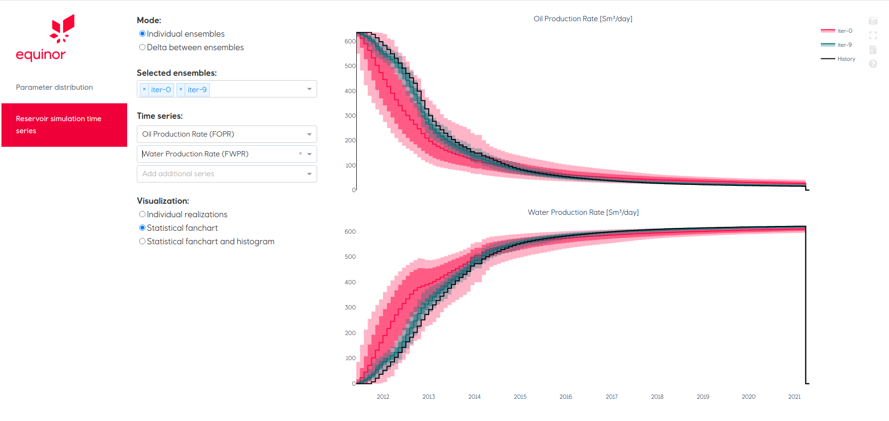

==========================
The Egg model case
==========================

The Egg model  is a synthetic reservoir model developed by `J. D. Jansen et al., 2013 <https://rmets.onlinelibrary.wiley.com/doi/pdf/10.1002/gdj3.21>`_[1]. We used the Egg model in the Computational Geosciences group at SINTEF Digital as a test case for developing data-driven models and testing new calibration methods for history matching.

Data files
==========

- `The Egg Model - data files [2] <https://data.4tu.nl/articles/The_Egg_Model_-_data_files/12707642>`_

Modifications to the simulations setup
======================================

We have modified the Egg model input file `Egg_Model_ECL.DATA` in order to follows Flownet workflow.

1. COMPAT section is changed to have differences in depth between injectors and producers. With this, we avoid problems related to degenerate tetrahedron that we obtain in the triangulation procedure for the network generation.

::

        COMPDAT
            'INJECT1'    2*    4     7 'OPEN' 2*     0.2 	1*          0 /                    
            'INJECT2'    2*    4     7 'OPEN' 2*     0.2 	1*          0 /            
            'INJECT3'    2*    4     7 'OPEN' 2*     0.2 	1*          0 /
            'INJECT4'    2*    4     7 'OPEN' 2*     0.2 	1*          0 /
            'INJECT5'    2*    4     7 'OPEN' 2*     0.2 	1*          0 /
            'INJECT6'    2*    4     7 'OPEN' 2*     0.2 	1*          0 /
            'INJECT7'    2*    4     7 'OPEN' 2*     0.2 	1*          0 /
            'INJECT8'    2*    4     7 'OPEN' 2*     0.2 	1*          0 /
            'PROD1'      2*    1     3 'OPEN' 2*     0.2 	1*          0 / 
            'PROD2'      2*    1     3 'OPEN' 2*     0.2 	1*          0 / 
            'PROD3'      2*    1     3 'OPEN' 2*     0.2 	1*          0 / 
            'PROD4'      2*    1     3 'OPEN' 2*     0.2	1*          0 /
        /
        
        

2. The section PROPS is saved as an independent file `PROPS.inc`.  

::

            DENSITY
                900 1000          1 /
            PVCDO
                400          1 1.000E-05        5        0/
            PVTW
                400          1 1.000E-05        1        0/

                
3. Output variables of interest have been specified in the SUMMARY section.

::

        SUMMARY
            FOPR
            FWPR
            FWIR
            WOPR
            'PROD1'
            'PROD2'
            'PROD3'
            'PROD4'
            /
            WWPR
            'PROD1'
            'PROD2'
            'PROD3'
            'PROD4'
            /
            WWIR
            'INJECT1' 
            'INJECT2'
            'INJECT3' 
            'INJECT4' 
            'INJECT5'
            'INJECT6'
            'INJECT7'
            'INJECT8'
            /   
            FOPT
            FWPT
            FWIT
            WLPR
            'PROD1'
            'PROD2'
            'PROD3'
            'PROD4'
            /
            WBHPH
            /
            WBHP
            /

4. Then you can run OPM FLOW to update input files to FlowNet

.. code-block:: bash

    flow /egg_model/input_file/Egg_Model_ECL.DATA
    
    
    

Assisted history matching example
=================================

The configuration files follow the `YAML standard <https://yaml.org/>`_.

.. literalinclude:: ../examples/egg_parameters.yml
   :language: yaml
   :linenos:
   
   
To run the assisted history matching in flownet:

.. code-block:: bash

   flowet ahm /config_file_directory/egg_parameters.yml  output_directory
   
   

Webiz visualization
===================

.. code-block:: bash

    python output_directory/generated_app/webviz_app.py

   
   
References
==========

[1] Jansen, J.D., Fonseca, R.M., Kahrobaei, S., Siraj, M.M., Van Essen, G.M., and Van den Hof, P.M.J.,        2014: The egg model - A geological ensemble for reservoir simulation. Geoscience Data Journal 1 (2) 192-195. https://doi.org/10.1002/gdj3.21    

[2] J.D. Jansen (2013): The Egg Model - data files. 4TU.ResearchData. Dataset.
    https://doi.org/10.4121/uuid:916c86cd-3558-4672-829a-105c62985ab2

