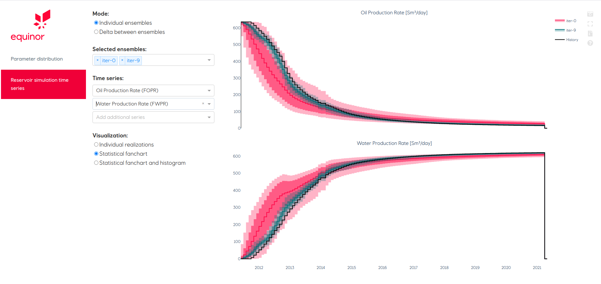

==========================
The Egg model case
==========================

The Egg model  is a synthetic reservoir model developed by `J. D. Jansen et al., 2013 <https://rmets.onlinelibrary.wiley.com/doi/pdf/10.1002/gdj3.21>`_. We used the Egg model in the Computational Geosciences group at SINTEF Digital as a test case for developing data-driven models and testing new calibration methods for history matching.

.. image:: ./_static/sintef_logo.jpg
   :scale: 10%

Data files
==========

- `The Egg Model - data files <https://data.4tu.nl/articles/The_Egg_Model_-_data_files/12707642>`_

Simulations setup pre-processing
=================================

1. All vertical wells in the egg model have the same depth. This creates degenerates 3D triangles in the triangulation algorithm used to generate the flow network.
This can be solved by changing the depth of the wells in COMPAT section of the egg model simulation file: `Egg_Model_ECL.DATA`. 

::

        COMPDAT
            'INJECT1'    2*    4     7 'OPEN' 2*     0.2 	1*          0 /                    
            'INJECT2'    2*    4     7 'OPEN' 2*     0.2 	1*          0 /            
            'INJECT3'    2*    4     7 'OPEN' 2*     0.2 	1*          0 /
            'INJECT4'    2*    4     7 'OPEN' 2*     0.2 	1*          0 /
            'INJECT5'    2*    4     7 'OPEN' 2*     0.2 	1*          0 /
            'INJECT6'    2*    4     7 'OPEN' 2*     0.2 	1*          0 /
            'INJECT7'    2*    4     7 'OPEN' 2*     0.2 	1*          0 /
            'INJECT8'    2*    4     7 'OPEN' 2*     0.2 	1*          0 /
            'PROD1'      2*    1     3 'OPEN' 2*     0.2 	1*          0 / 
            'PROD2'      2*    1     3 'OPEN' 2*     0.2 	1*          0 / 
            'PROD3'      2*    1     3 'OPEN' 2*     0.2 	1*          0 / 
            'PROD4'      2*    1     3 'OPEN' 2*     0.2	1*          0 /
        /
        
        

2. The section PROPS should be saved as a indepedent file with file-name `PROPS.inc`.

::

            DENSITY
                900 1000          1 /
            PVCDO
                400          1 1.000E-05        5        0/
            PVTW
                400          1 1.000E-05        1        0/

                
3. Output variables of interest must be specified. For instance, we add in the SUMMARY section the following

::

        SUMMARY
            FOPR
            FWPR
            FWIR
            WOPR
            'PROD1'
            'PROD2'
            'PROD3'
            'PROD4'
            /
            WWPR
            'PROD1'
            'PROD2'
            'PROD3'
            'PROD4'
            /
            WWIR
            'INJECT1' 
            'INJECT2'
            'INJECT3' 
            'INJECT4' 
            'INJECT5'
            'INJECT6'
            'INJECT7'
            'INJECT8'
            /   
            FOPT
            FWPT
            FWIT
            WLPR
            'PROD1'
            'PROD2'
            'PROD3'
            'PROD4'
            /
            WBHPH
            /
            WBHP
            /

4. Then you can run OPM FLOW to update output files that flownet requires

    ``$ flow Egg_Model_ECL.DATA``
    
    
    

Assisted history matching example
=================================

The configuration files follow the `YAML standard <https://yaml.org/>`_.

.. literalinclude:: ../examples/egg_parameters.yml
   :language: yaml
   :linenos:
   
   
To run the assisted history matching in flownet type:
   ``$ flowet ahm /config_file_directory/egg_parameters_Wouter.yml  output_directory``
   
   

Webiz visualization
===================

    ``$ python output_directory/generated_app/webviz_app.py``

   
   
