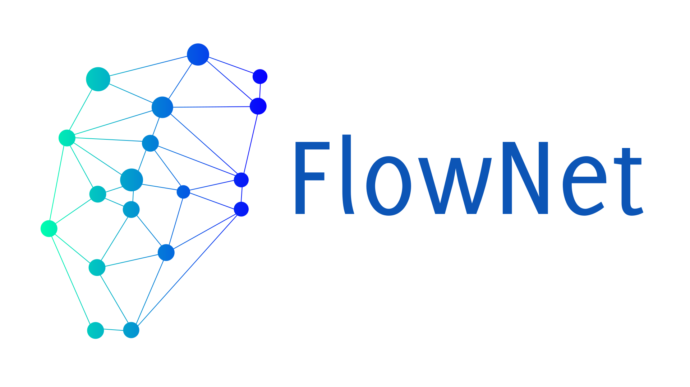

============
Introduction
============

**FlowNet** aims at making predictive subsurface models directly from data. Instead of
complex simulation grids, FlowNet uses networks of tubes (with full physics within each tube),
speeding up simulation models by order of magnitudes, which again makes it possible with
e.g. increased sampling of the uncertainty span compared with traditional workflows.

Key features
============

- **Fast model building:** Very efficiently get an ensemble of subsurface models,
  compared to duration of traditional modeling projects.

- **Fast simulation runtime:** Reduce the simulation time per model realization
  by order of magnitudes, which can be traded for e.g. better sampling of your
  uncertainty span.

- **Automatic parametrization:** FlowNet will automatically parametrize typical subsurface
  uncertainties for you.

- **Data driven:** FlowNet will use what typically is considered raw data in a model
  building process directly.

- **Easy:** As FlowNet user, you only need to adjust a
  :doc:`high level configuration file <./configuration_file>` - no Python
  skills necessary.

- **Standards-based:** Based on and compatible with open standards. FlowNets stands on the shoulders of giants:

 - `ERT <https://github.com/equinor/ert>`_ for doing uncertinaty sampling (and optionally assisted history matching).
 - `Flow <https://github.com/OPM/opm-simulators>`_ for running the simulation models.
 - `Webviz <https://github.com/equinor/webviz-config>`_ for visualization of results (profiles, history match quality, parameter distributions...)
 - `ResInsight <https://github.com/OPM/ResInsight>`_ for three dimensional exploration of the network and simulation grid results.

Overview
========

FlowNet aims at being data driven software. I.e. the preferred way is that raw
input data to FlowNet should arrive from APIs (from other softwares). However,
in order to also facilitate testing and developing FlowNet without an available data API
framework, FlowNet can also extract necessary input data from an existing simulation model.

.. image:: ./_static/flownet-concept.svg

Automatic parametrization
=========================

In traditional modelling workflows, the user has to parametrize the model manually
when setting it up. This is time consuming and routine work, and can also result
in less parametrization (which again might result in not spanning the real uncertainty span).

FlowNet will automatically add typical parametrizations, and leave only responsibility
for high level options (e.g. prior-distribution end-points) to the user,
which he/she sets through the :doc:`configuration file <./configuration_file>`.

FlowNet currently supports the following automatic parametrization:

- Aquifers
- Equilibration
- Fault transmissibilities
- Permeabilities
- Porosity and porevolumes
- Relative permeabilities
- Rock compressibility

To be added:

- PVT table parametrization
- Lift curve parametrization
- ...

Benchmark models
================

The core developers of FlowNet are currently testing on the following open benchmark models:

 - `Norne model <https://github.com/OPM/opm-data/tree/master/norne>`_
 - `Brugge model <https://www.isapp2.com/data-sharepoint/brugge-data-set.html>`_ (soon to be available on GitHub)
 - `Egg model <https://data.4tu.nl/repository/uuid:916c86cd-3558-4672-829a-105c62985ab2>`_

A small Norne assisted history matching example using FlowNet is automatically started
on each commit to FlowNet pull requests, in order verify the code changes.

Going forward, we will try to aim for having an Azure resource running on merge to `master`,
and then have the results (profiles, history match profiles etc.) automatically pushed back
to the FlowNet repository - showing current results on the benchmark model.
